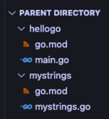

Custom Package
Let's write a package to import and use in hellogo.

Assignment
Create a sibling directory in the parent directory of the hellogo directory:
cd ..
mkdir mystrings
cd mystrings

Initialize a module:
go mod init {REMOTE}/{USERNAME}/mystrings

Create a new file mystrings.go in that directory and paste the following code:
// by convention, we name our package the same as the directory
package mystrings

// Reverse reverses a string left to right
// Notice that we need to capitalize the first letter of the function
// If we don't then we won't be able to access this function outside of the
// mystrings package
func Reverse(s string) string {
  result := ""
  for _, v := range s {
    result = string(v) + result
  }
  return result
}

Only capitalized names are exported, meaning they can be accessed by other packages. Uncapitalized names are private.

Notice there is no main.go or func main() in this package.
Run go build . Because this isn't a main package, it won't build an executable. However, go build will still compile the package and save it to our local build cache. It's useful for checking for compile errors.
Run and submit the CLI tests from the root of the mystrings package.

File Directory

