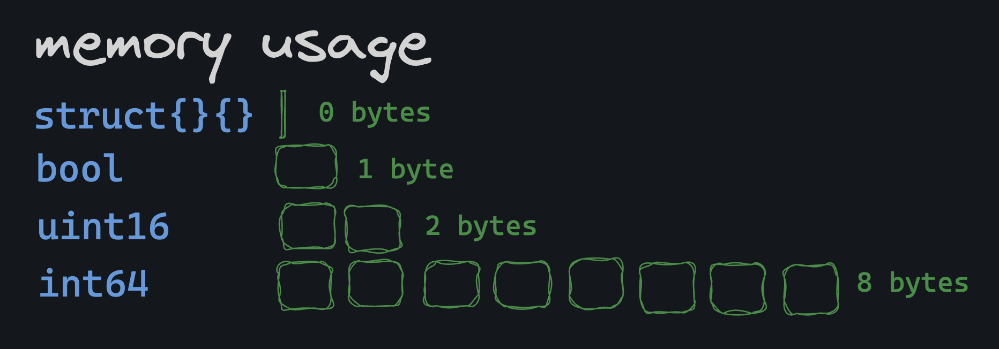

# Empty Struct

Empty structs are used in Go as a unary value.

```
// anonymous empty struct type
empty := struct{}{}

// named empty struct type
type emptyStruct struct{}
empty := emptyStruct{}
```

The cool thing about empty structs is that they're the smallest possible type in Go: they take up zero bytes of memory.



memory usage

Later in this course, you'll see how and when they're used: it's surprisingly often! Mostly with maps and channels.


